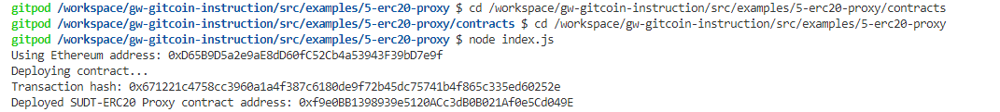
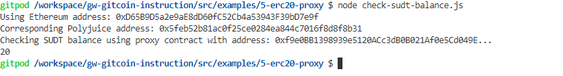

## Task 5 Deploy The ERC20 Proxy Contract For The Deposited SUDT

1.


2.The address of the ERC20 Proxy Contract you deployed (in text format).
```sh
0xf9e0BB1398939e5120ACc3dB0B021Af0e5Cd049E
```

3.A screenshot of the console output immediately after checking your SUDT balance.


4.The Ethereum address that was checked (in text format).
```sh
0xD65B9D5a2e9aE8dD60fC52Cb4a53943F39bD7e9f
```